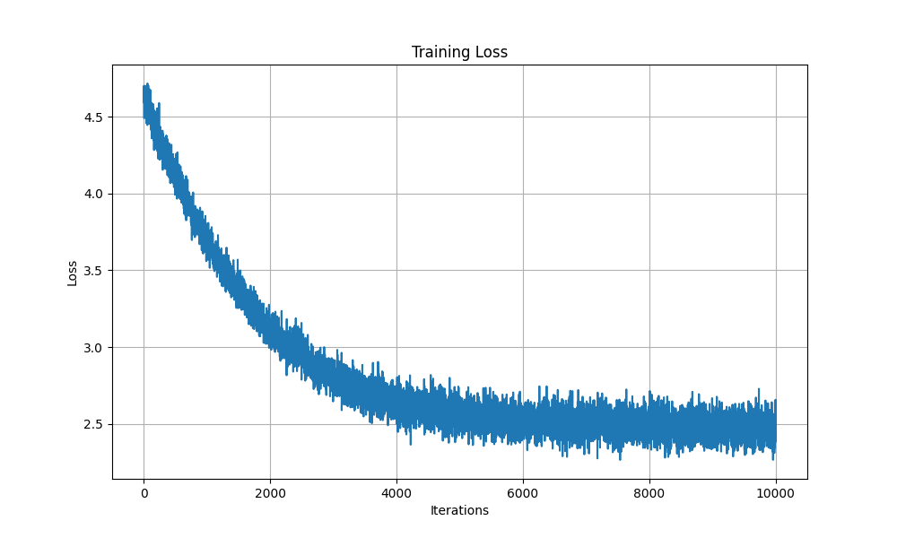

# HandMade GPT

## Technical Summary: Character-Level Tokenizer Implementation

### Overview
This project implements a basic character-level tokenizer for text processing, designed as a foundational component for a handmade GPT model.

### Tokenizer Architecture

#### Core Components:

1. **Text Reading & Analysis** (`read_file()`)
   - Reads raw text from file input
   - Extracts unique characters and calculates vocabulary size
   - Returns text content, character set, and vocabulary size

2. **Character-to-Integer Mapping** (`creat_mapping()`)
   - Creates bidirectional mappings:
     - `stoi`: Character → Integer (string-to-index)
     - `itos`: Integer → Character (index-to-string)
   - Enables reversible encoding/decoding

3. **Encoding Function** (`encode()`)
   - Converts text string to integer sequence using character mapping
   - Each character is replaced with its corresponding integer index

4. **Decoding Function** (`decode()`)
   - Reverses encoding process
   - Converts integer sequence back to original text string

#### Data Flow:
```
Raw Text → Character Extraction → Mapping Creation → Integer Encoding → PyTorch Tensor
```
Sting-to-int that we get : 
```
stoi = {'\n': 0, ' ': 1, '!': 2, '$': 3, '&': 4, "'": 5, ',': 6, '-': 7, '.': 8, '3': 9, ':': 10, ';': 11, '?': 12, 'A': 13, 'B': 14, 'C': 15, 'D': 16, 'E': 17, 'F': 18, 'G': 19, 'H': 20, 'I': 21, 'J': 22, 'K': 23, 'L': 24, 'M': 25, 'N': 26, 'O': 27, 'P': 28, 'Q': 29, 'R': 30, 'S': 31, 'T': 32, 'U': 33, 'V': 34, 'W': 35, 'X': 36, 'Y': 37, 'Z': 38, 'a': 39, 'b': 40, 'c': 41, 'd': 42, 'e': 43, 'f': 44, 'g': 45, 'h': 46, 'i': 47, 'j': 48, 'k': 49, 'l': 50, 'm': 51, 'n': 52, 'o': 53, 'p': 54, 'q': 55, 'r': 56, 's': 57, 't': 58, 'u': 59, 'v': 60, 'w': 61, 'x': 62, 'y': 63, 'z': 64}
```

The enocding of the first 150 elements the input text should look like this:  

```
tensor([18, 47, 56, 57, 58,  1, 15, 47, 58, 47, 64, 43, 52, 10,  0, 14, 43, 44,
        53, 56, 43,  1, 61, 43,  1, 54, 56, 53, 41, 43, 43, 42,  1, 39, 52, 63,
         1, 44, 59, 56, 58, 46, 43, 56,  6,  1, 46, 43, 39, 56,  1, 51, 43,  1,
        57, 54, 43, 39, 49,  8,  0,  0, 13, 50, 50, 10,  0, 31, 54, 43, 39, 49,
         6,  1, 57, 54, 43, 39, 49,  8,  0,  0, 18, 47, 56, 57, 58,  1, 15, 47,
        58, 47, 64, 43, 52, 10,  0, 37, 53, 59,  1, 39, 56, 43,  1, 39, 50, 50,
         1, 56, 43, 57, 53, 50, 60, 43, 42,  1, 56, 39, 58, 46, 43, 56,  1, 58,
        53,  1, 42, 47, 43,  1, 58, 46, 39, 52,  1, 58, 53,  1, 44, 39, 51, 47,
        57, 46, 12,  0,  0, 13, 50, 50, 10,  0, 30, 43, 57, 53, 50, 60, 43, 42,
         8,  1, 56, 43, 57, 53, 50, 60, 43, 42,  8,  0,  0, 18, 47, 56, 57, 58,
         1, 15, 47, 58, 47, 64, 43, 52, 10,  0, 18, 47, 56, 57, 58,  6,  1, 63,
        53, 59])
```


#### Tiktoken

Let's check how a complete high-end tokenizer  should look like, Tiktoken is a BPE tokenizer created by openAI and also very widely used in other open-source models.

We use the tiktoken library that implements Byte Pair Encoding to break text into subword tokens (not charcters and not entire words). And in this example we are using the GPT-2 tokenizer (Vocabulary Size: ~50,257 tokens)

Let's see an example of some of the common word encodings of tiktoken:

```
'hello' -> [31373] -> 'hello'
'world' -> [6894] -> 'world'
'the' -> [1169] -> 'the'
'and' -> [392] -> 'and'
'python' -> [29412] -> 'python'
'AI' -> [20185] -> 'AI'
'I love machine learning' -> [40, 1842, 4572, 4673] -> 'I love machine learning'
```

You can already see the impact of having a wider vocabulary size on the outpur sequence of the encoder ! It makes your encoding much effiecient and less memory-intensive.

Example: 

```
len(tiktoken_encode_text)/len(encode_text) = 0.3030543467151518 (30%)
```

#### Chunking and Block size

The idea here is to create the sequences that we are going to feed to the model. After encoding the text we will first split up our data to train and validation to evaluate our training process (Ovefitting).

The first dimension of our input tensor is going to be the `block_size`, it refers to the fixed lenghts of the sequences that we are going to keep feeding to the model.

On the other hand the next dimension is going to be `Batch_size`, this is basacly how many examples of the sequences that we want to feed to the model at the same time to make use of the parallele computing (Make GPU busy).

Next we want to create ourt target (We have to set a goal for the model so it can follow it during the learning).The goal here is going to be to predict the next token knowing various context lenghts. 

Example: 
```
text : I drive my car everyday.
model_inpuy : I drive my
the prediction : car
```
POV of the model during the training process:

```
single input vector : [24, 43, 58, 5, 57, 1, 46, 43]
batch : [[24, 43, 58,  5, 57,  1, 46, 43],
        [44, 53, 56,  1, 58, 46, 39, 58],
        [52, 58,  1, 58, 46, 39, 58,  1],
        [25, 17, 27, 10,  0, 21,  1, 54]]

when input is [24] the target: 43
when input is [24, 43] the target: 58
when input is [24, 43, 58] the target: 5
when input is [24, 43, 58, 5] the target: 57
when input is [24, 43, 58, 5, 57] the target: 1
when input is [24, 43, 58, 5, 57, 1] the target: 46
when input is [24, 43, 58, 5, 57, 1, 46] the target: 43
when input is [24, 43, 58, 5, 57, 1, 46, 43] the target: 39
```

## Bigram model

We're going to start by creating a simple model that is based on Markov theory (knowing the previous state, what is the probability of the next state being a certain value).

Following this same principle, we can create a process that can learn how to predict the next token knowing a certain context window.
The loss we need to optimize here is going to be: 
```
loss = F.cross_entropy(logits, targets)
```
Where the logits are going to represent the vocabulary of the 
model and it's assosiated probabalities.

We start with a randomly itialized model and we try to generate text using only the lest token as an input:
Example : 

```
input: [24, 43, 58, 5, 57, 1, 46, 43] ==> "Let's he"
generate: Let's heXJamq!iui$
----------------------------------------------------------------------------------------------------
input: [44, 53, 56, 1, 58, 46, 39, 58] ==> "for that"
generate: for thatIRCRz&CDio
```

Afterwards we use our training process to learn the BigramModel and complete and generate new tokens for us.

Loss function of our training (10k epochs):



After training, our model can generate more coherent text based on the input context:

```
input: Let's he
generate: Let's hed I'dofons
--------------------
input: for that
generate: for that sprs m; i
--------------------
input: nt that
generate: nt that thad bupan
--------------------
input: MEO:
I p
generate: MEO:
I paceereneve
```
It looks less Chaotic than before (still nothing make sens beacause the mdoel is still too simple to capture high level patterns and relationships between the tokens)

##TODO 
* Check the BigramLanguageModel
* Check attention 
* Check Multi-Head Latent Attention (MLA)
* Check Bert
* vLLM